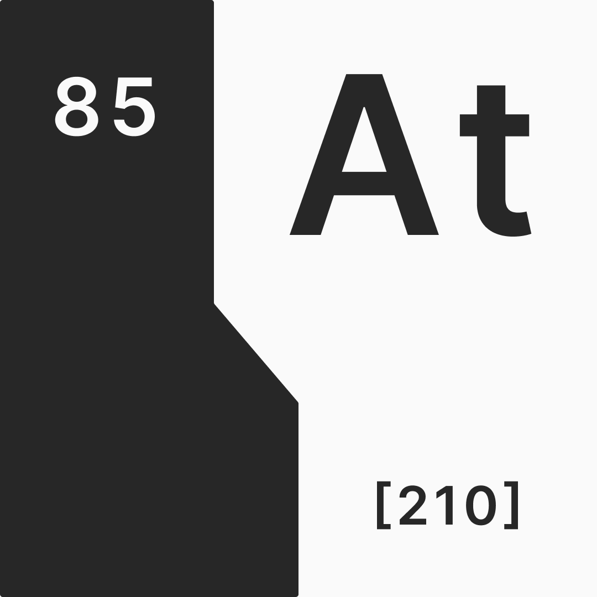

# Astatine

A Configurable Automated Profit Sharing Token Distributor.

## Configuration

You must use the [linear](https://www.desmos.com/calculator/05ofbspddf) or [exponential](https://www.desmos.com/calculator/mvcfqcvtwp) decay calculators to determine the configuration.

### Configuration

You need to modify [`config.js`](config.js) according to your requirements. Below are explanations for each of the configuration variables.

- `token_contract_id: String` - The contract ID of the token being emitted
- `emission_period: Integer` - **(_E_)** Emission time period in seconds
- `time_interval: Integer` - **(_I_)** Number of seconds in between each distribution cycle
- `initial_emit_amount: Integer` - **(_A_)** The initial amount of tokens to emit
- `decay_const` - **(_k_)** The decay constant for an exponential decay curve

> Note: Set `decay_const` as null if you're using linear curve!

#### Token Allocation Function

The taf is what determines who PSTs are sent to on each run. You must build this function yourself, but the function must return one of two options:

**Format 1:**

```json
["pvPWBZ8A5HLpGSEfhEmK1A3PfMgB_an8vVS6L14Hsls", "WNeEQzI24ZKWslZkQT573JZ8bhatwDVx6XVDrrGbUyk"]
```

Each wallet address would be distributed an equal amount of PSTs at a given run

**Format 2:**

```json
[
  {
    "address": "pvPWBZ8A5HLpGSEfhEmK1A3PfMgB_an8vVS6L14Hsls",
    "weight": 6
  },
  {
    "address": "WNeEQzI24ZKWslZkQT573JZ8bhatwDVx6XVDrrGbUyk",
    "weight": 4
  }
]
```

Each wallet address would be distributed an amount equivalent to its weight out of the total

> In the above example, _wallet 1_ would receive 60% and _wallet 2_ would receive 40% of the PSTs being distributed at that time

### Workflow

You need to set the schedule in [`.github/workflows/decay.yml`](.github/workflows/decay.yml) equal to the interval you set in the Configuration. You can refer to [crontab.guru](https://crontab.guru/) for more info on cron syntax.

```yml
on:
  workflow_dispatch:
  schedule:
    - cron: '* * * * *'
```

> Note: GitHub's cron scheduler has an error margin of ±5 minutes, so try to keep the interval greater than at least 15 minutes. Also GitHub doesn't support cron interval less than 1 minute or greater than 1 year.

**Arweave Keyfile**

You also need to store your Arweave keyfile as a GitHub Secret named `KEYFILE` and the contents of your arweave keyfile as the value. Visit the [Secrets documentation](https://docs.github.com/en/free-pro-team@latest/actions/reference/encrypted-secrets) for more info.

## License

This software is licensed under [The MIT License](LICENSE)
